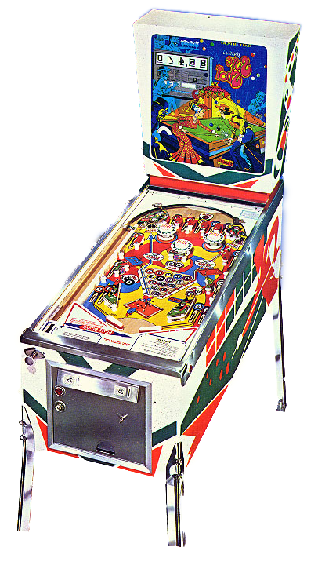

# 🎱 Sure Shot Modern 

Sure Shot Modern is the reimplementation of the old Gottlieb solid state pinball machine [Sure Shot](https://www.ipdb.org/machine.cgi?id=2457).  We took the original pinball machine built in 1976, gutted it, and brought it back to life using modern electronics that allow for even more goodness.

* **Original** cabinet and backbox and backglass. 
* **Reused** the playfield, and all playfield components like pop-bumpers, targets, etc.
* Same flipper bats and rubbers, but upgraded the **flipper coils** to more modern style.
* Pulled out all mechanical state machines and power supply including lots of old fabric wrapped wire.

  
  
  

* Modern hardware is using the [Fast Pinball Platform](https://fastpinball.com/) that provides the power filter board, controller board, and multiple I/O Boards that fan out throughout the machine and are the places the the pinball hardware plugs in...
  
I ended up needing 2x-3208 and 2x-0804.  The 3208 has 32 switches and 8 drivers for coils while the 0804 has 8 switches and 4 drivers.  The system is designed to be extensible depending on your pinball designs and layouts.  
  
Their system worked beautifully and it was a joy to use.  The documentation was second to none.  10/10, will use again.
* Fast takes care of the low level power, wiring and control substrate.  On top of that I used [The Mission Pinball Framework](https://missionpinball.org/) to define the ruleset and operation of the game.  That was also a fun experience learning how to define a semi-complex system in YAML.

  
  
  

## What's Next

Work done up to now was about replicating the original machines rules and behaviors.  Now that we're on this modern stack we should be able to more easily define alternative rulesets that we can run alongside the original to experiment with pinball design.